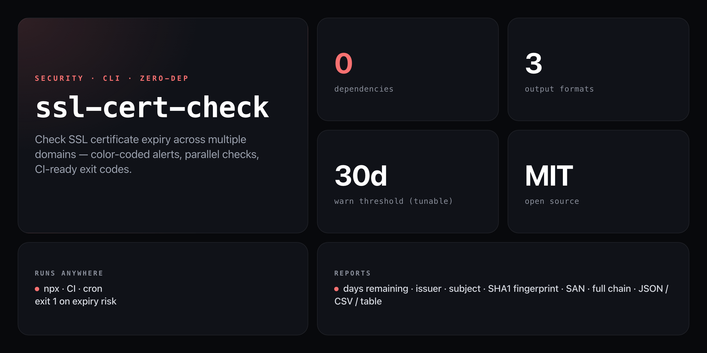

<div align="center">

**Check SSL certificate expiry before your users notice the padlock is gone.**


</div>

---

A forgotten SSL renewal silently breaks HTTPS for every visitor. `ssl-cert-check` connects directly to each host via Node's built-in `tls` module — no npm dependencies, no API keys — and returns days remaining, issuer, fingerprint, and full chain in the format your pipeline needs.

```
SSL Certificate Report  (warn threshold: 30d)

────────────────────────────────────────────────────────────────────────────────
✓ github.com                              87d
  Issuer : DigiCert Inc
  Subject: github.com
  Valid  : 2025-03-06 → 2026-06-07
  SHA1   : AB:CD:12:34:...
────────────────────────────────────────────────────────────────────────────────
⚠ api.example.com                         12d
  Issuer : Let's Encrypt
  Subject: api.example.com
  Valid  : 2025-09-15 → 2026-06-30
────────────────────────────────────────────────────────────────────────────────

Summary: OK: 1  Warning: 1  Critical: 0  Expired: 0  Errors: 0
```

## Install

No install needed — runs straight from GitHub with zero dependencies:

```bash
npx github:NickCirv/ssl-cert-check github.com
```

## Usage

```bash
# Check one or more domains
npx github:NickCirv/ssl-cert-check github.com google.com cloudflare.com

# Custom port (non-443 TLS services)
npx github:NickCirv/ssl-cert-check example.com:8443

# Read from a file (newline-separated, # comments supported)
npx github:NickCirv/ssl-cert-check --file domains.txt

# Change warning threshold (default: 30 days)
npx github:NickCirv/ssl-cert-check github.com --warn-days 14

# JSON output — pipe to jq, monitoring systems, or save to file
npx github:NickCirv/ssl-cert-check github.com --format json

# CSV output — import into spreadsheets or dashboards
npx github:NickCirv/ssl-cert-check github.com --format csv

# Inspect the full certificate chain
npx github:NickCirv/ssl-cert-check github.com --chain

# Custom per-domain timeout (seconds, default: 10)
npx github:NickCirv/ssl-cert-check github.com --timeout 5
```

## Flags

| Flag | Default | Description |
|------|---------|-------------|
| `-f, --file <path>` | — | Read domains from a newline-separated file (`#` comments ignored) |
| `-w, --warn-days <n>` | `30` | Days threshold for warning color / exit code |
| `--format <fmt>` | `table` | Output format: `table`, `json`, `csv` |
| `--chain` | off | Show full certificate chain per domain |
| `--timeout <sec>` | `10` | Per-domain connection timeout in seconds |
| `-h, --help` | — | Show help |

## What it reports

For each domain: days remaining (color-coded), validity window, CN subject, issuer organisation, SHA1 fingerprint, Subject Alternative Names, and optionally the full chain — all from a single TLS handshake with no external calls.

**Color coding (table format)**

| Color | Meaning |
|-------|---------|
| Green | Beyond warn-days threshold |
| Yellow | Within warn-days threshold |
| Red | Less than 7 days remaining, or expired |

**JSON output shape**

```json
{
  "host": "github.com",
  "port": 443,
  "daysLeft": 87,
  "validFrom": "2025-03-06T00:00:00.000Z",
  "validTo": "2026-06-07T23:59:59.000Z",
  "subject": "github.com",
  "issuer": "DigiCert Inc",
  "serialNumber": "...",
  "fingerprint": "AB:CD:...",
  "san": "DNS:github.com, DNS:www.github.com"
}
```

## CI / cron usage

Exit code is `1` when any cert is expired, within the warn window, or unreachable — exit `0` when all are clean. Plug directly into any CI or scheduled job:

```yaml
# GitHub Actions — alert 14 days before expiry
- name: Check SSL certificates
  run: npx github:NickCirv/ssl-cert-check --file domains.txt --warn-days 14
```

```bash
# cron — daily alert via email or Slack webhook
sslcheck --file /etc/ssl-domains.txt --warn-days 14 || ./notify.sh "SSL expiry warning"
```

## domains.txt format

```
# Production
github.com
api.github.com

# Staging
staging.example.com:8443
```

## What it is NOT

- **Not a certificate manager or auto-renewer.** It checks and reports — renewal (Let's Encrypt, ACME, cert-manager) is a separate concern.
- **Not a network scanner.** It only checks domains you explicitly list; it doesn't enumerate subdomains.
- **Not a guarantee of browser trust.** `rejectUnauthorized: false` lets it inspect self-signed or misconfigured certs and report on them rather than erroring out — the reported data is still accurate.

---

<div align="center">
<sub>Zero dependencies · Node 18+ · MIT · by <a href="https://github.com/NickCirv">NickCirv</a></sub>
</div>
